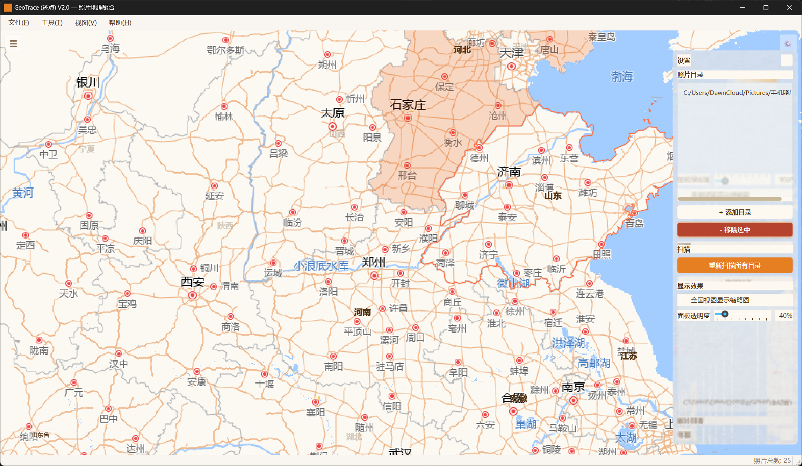

# GeoTrace（迹点）

> 桌面端离线照片地理聚合与检索应用

读取本地照片目录的 EXIF GPS 数据，通过离线逆地理编码映射至中国各省份，使用原生 QPainter 手绘中国地图进行可视化交互，按省份检索浏览照片。

## 功能特性

- **EXIF GPS 提取** — 批量扫描照片目录，自动提取 GPS 坐标
- **离线逆地理编码** — 基于 Shapely + R-Tree + GeoJSON 本地化解析省份
- **手绘中国地图** — 原生 QPainter 渲染，无 GPU / QWebEngine 依赖
- **暖色热力图** — 按照片数量 4 级渐变色阶可视化
- **照片网格浏览** — 卡片式缩略图，滚轮自动分页加载
- **大图查看器** — 无级缩放 + 拖拽平移 + 毛玻璃切换按钮
- **SQLite 存储** — WAL 模式多线程并发，触发器自动维护统计表

## 技术栈

| 分类 | 技术 |
|------|------|
| 语言 | Python 3.11+ |
| GUI | PySide6 |
| 地图渲染 | QPainter + Shapely → QPainterPath |
| 空间计算 | Shapely + R-Tree |
| 存储 | SQLite3 (WAL) |
| EXIF | Pillow + exifread |

## 快速开始

```bash
cd GeoTrace
.venv\Scripts\activate
python -m geotrace
```

或双击 `启动GeoTrace.bat`（使用 pythonw.exe 无控制台窗口启动）。

## 项目结构

```
GeoTrace/
├── data/
│   └── china_provinces.geojson    # 中国 34 省行政区划 (DataV.GeoAtlas, WGS84)
├── geotrace/
│   ├── app.py                     # QApplication 入口
│   ├── core/                      # EXIF 提取 + 空间索引
│   ├── database/                  # SQLite DDL + CRUD
│   ├── ui/                        # 主窗口 / 地图 / 照片网格 / 查看器
│   └── workers/                   # 异步扫描 + 缩略图生成
└── requirements.txt
```

## 核心数据流

```
用户选择目录 → 磁盘扫描 → EXIF GPS 提取
  → R-Tree 省份定位 → 写入 SQLite
  → 触发器自动更新统计 → QPainter 热力图重绘

用户点击省份 → 异步查询 → 照片网格展示
  → 双击大图查看（无级缩放 + 拖拽平移）
```

## 截图



## License

MIT
